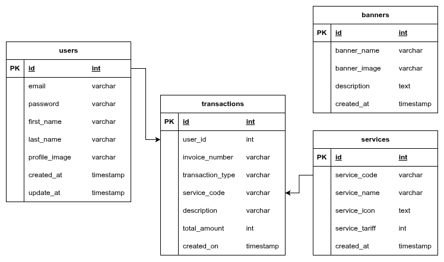

# Nutech Take Home Test API

Backend RESTful API untuk keperluan Take Home Test yang dibangun menggunakan Express.js dan TypeScript.

## 📋 Daftar Isi

- [Tentang Project](#-tentang-project)
- [Tech Stack](#-tech-stack)
- [Fitur](#-fitur)
- [Entity Relationship Diagram (ERD)](#-entity-relationship-diagram-erd)
- [Instalasi](#-instalasi)
- [Menjalankan Aplikasi](#-menjalankan-aplikasi)
- [API Endpoints](#-api-endpoints)
- [Contoh Penggunaan API](#-contoh-penggunaan-api)
- [Struktur Project](#-struktur-project)

---

## 📖 Tentang Project

**Nutech Membership API** adalah backend service yang menyediakan layanan keanggotaan digital lengkap dengan fitur pembayaran PPOB. Sistem ini memungkinkan pengguna untuk:

- Mendaftar dan masuk ke aplikasi
- Mengelola profil pengguna
- Melakukan top up saldo
- Melakukan transaksi pembayaran berbagai layanan (PLN, PDAM, Pulsa, dll)
- Melihat riwayat transaksi

API ini dibangun dengan arsitektur **Repository Pattern** yang memisahkan logika bisnis dari akses data, serta menggunakan **Raw SQL dengan Prepared Statements** untuk keamanan maksimal terhadap SQL Injection.

---

## 🛠 Tech Stack

### Core Technologies

| Technology     | Description                                                           |
| -------------- | --------------------------------------------------------------------- |
| **Node.js**    | JavaScript runtime environment (v18+)                                 |
| **Express.js** | Web framework untuk Node.js yang minimalis dan fleksibel              |
| **TypeScript** | Superset JavaScript dengan static typing untuk code yang lebih robust |
| **PostgreSQL** | Database relasional open-source yang powerful (v14+)                  |

### Libraries & Tools

| Library                | Kegunaan                                                    |
| ---------------------- | ----------------------------------------------------------- |
| **JWT (jsonwebtoken)** | Autentikasi berbasis token dengan expirasi 12 jam           |
| **bcryptjs**           | Hashing password dengan algoritma bcrypt                    |
| **Zod**                | Schema validation untuk request body dan parameters         |
| **Multer**             | Middleware untuk handling file upload (multipart/form-data) |
| **pg (node-postgres)** | Driver PostgreSQL untuk Node.js                             |
| **uuid**               | Generate unique identifier untuk invoice dan file naming    |
| **dotenv**             | Manajemen environment variables                             |

### Development Tools

| Tool    | Kegunaan                                                |
| ------- | ------------------------------------------------------- |
| **tsx** | TypeScript executor untuk development dengan hot-reload |
| **tsc** | TypeScript compiler untuk production build              |

---

## ✨ Fitur

Project ini terbagi menjadi **3 Module utama**:

### 1️⃣ Module Membership

Modul untuk manajemen keanggotaan pengguna.

| Endpoint          | Method | Auth | Deskripsi                        |
| ----------------- | ------ | ---- | -------------------------------- |
| `/registration`   | POST   | ❌   | Registrasi pengguna baru         |
| `/login`          | POST   | ❌   | Login dan mendapatkan JWT token  |
| `/profile`        | GET    | ✅   | Mendapatkan data profil pengguna |
| `/profile/update` | PUT    | ✅   | Update informasi profil (nama)   |
| `/profile/image`  | PUT    | ✅   | Upload foto profil (JPEG/PNG)    |

**Ketentuan:**

- Email harus dalam format valid
- Password minimal 8 karakter
- JWT token berlaku selama **12 jam**
- Upload gambar hanya menerima format **JPEG** dan **PNG**

### 2️⃣ Module Information

Modul untuk menyediakan informasi banner dan layanan.

| Endpoint    | Method | Auth | Deskripsi                         |
| ----------- | ------ | ---- | --------------------------------- |
| `/banner`   | GET    | ❌   | Mendapatkan daftar banner promosi |
| `/services` | GET    | ✅   | Mendapatkan daftar layanan PPOB   |

**Layanan yang tersedia:**

- Pajak PBB
- PLN (Listrik)
- PDAM
- Pulsa
- PGN
- Musik Berlangganan
- TV Berlangganan
- Paket Data
- Voucher Game
- Voucher Makanan
- Qurban
- Zakat

### 3️⃣ Module Transaction

Modul untuk transaksi keuangan pengguna.

| Endpoint               | Method | Auth | Deskripsi                           |
| ---------------------- | ------ | ---- | ----------------------------------- |
| `/balance`             | GET    | ✅   | Mendapatkan saldo terakhir          |
| `/topup`               | POST   | ✅   | Top up saldo pengguna               |
| `/transaction`         | POST   | ✅   | Melakukan pembayaran layanan        |
| `/transaction/history` | GET    | ✅   | Riwayat transaksi dengan pagination |

**Ketentuan:**

- Top up amount harus angka positif (> 0)
- Transaksi pembayaran akan mengurangi saldo
- Saldo harus mencukupi untuk melakukan pembayaran
- History transaksi mendukung **offset** dan **limit** untuk pagination

---

## 📊 Entity Relationship Diagram (ERD)



### Struktur Database

Database terdiri dari **4 tabel utama** dengan relasi sebagai berikut:

#### 1. Tabel `users`

Menyimpan informasi pengguna yang terdaftar dalam sistem.

| Kolom           | Tipe Data | Keterangan                          |
| --------------- | --------- | ----------------------------------- |
| `id`            | INT (PK)  | Primary key, auto-increment         |
| `email`         | VARCHAR   | Email unik pengguna                 |
| `password`      | VARCHAR   | Password yang di-hash dengan bcrypt |
| `first_name`    | VARCHAR   | Nama depan pengguna                 |
| `last_name`     | VARCHAR   | Nama belakang pengguna              |
| `profile_image` | VARCHAR   | URL foto profil (nullable)          |
| `balance`       | INT       | Saldo pengguna (default: 0)         |
| `created_at`    | TIMESTAMP | Waktu registrasi                    |
| `updated_at`    | TIMESTAMP | Waktu update terakhir               |

#### 2. Tabel `transactions`

Menyimpan seluruh riwayat transaksi pengguna.

| Kolom              | Tipe Data    | Keterangan                                           |
| ------------------ | ------------ | ---------------------------------------------------- |
| `id`               | INT (PK)     | Primary key, auto-increment                          |
| `user_id`          | INT (FK)     | Foreign key ke tabel users                           |
| `invoice_number`   | VARCHAR      | Nomor invoice unik                                   |
| `transaction_type` | VARCHAR      | Tipe transaksi (TOPUP / PAYMENT)                     |
| `service_code`     | VARCHAR (FK) | Foreign key ke tabel services (nullable untuk TOPUP) |
| `description`      | VARCHAR      | Deskripsi transaksi                                  |
| `total_amount`     | INT          | Nominal transaksi                                    |
| `created_on`       | TIMESTAMP    | Waktu transaksi                                      |

#### 3. Tabel `services`

Menyimpan daftar layanan PPOB yang tersedia.

| Kolom            | Tipe Data | Keterangan                  |
| ---------------- | --------- | --------------------------- |
| `id`             | INT (PK)  | Primary key, auto-increment |
| `service_code`   | VARCHAR   | Kode unik layanan           |
| `service_name`   | VARCHAR   | Nama layanan                |
| `service_icon`   | TEXT      | URL icon layanan            |
| `service_tariff` | INT       | Tarif layanan               |
| `created_at`     | TIMESTAMP | Waktu pembuatan             |

#### 4. Tabel `banners`

Menyimpan data banner promosi.

| Kolom          | Tipe Data | Keterangan                  |
| -------------- | --------- | --------------------------- |
| `id`           | INT (PK)  | Primary key, auto-increment |
| `banner_name`  | VARCHAR   | Nama banner                 |
| `banner_image` | VARCHAR   | URL gambar banner           |
| `description`  | TEXT      | Deskripsi banner            |
| `created_at`   | TIMESTAMP | Waktu pembuatan             |

### Relasi Antar Tabel

```
┌─────────────────────────────────────────────────────────────────┐
│                          RELASI ERD                             │
├─────────────────────────────────────────────────────────────────┤
│                                                                 │
│   users (1) ─────────────< (N) transactions                    │
│      │                           │                              │
│      │   Satu user dapat         │   Setiap transaksi          │
│      │   memiliki banyak         │   dimiliki oleh satu user   │
│      │   transaksi               │                              │
│      │                           │                              │
│                                  │                              │
│   services (1) ──────────< (N) transactions                    │
│      │                                                          │
│      │   Satu service dapat memiliki banyak transaksi          │
│      │   (untuk tipe PAYMENT)                                   │
│                                                                 │
│   banners ─── Standalone (tidak berelasi)                      │
│                                                                 │
└─────────────────────────────────────────────────────────────────┘
```

---

## 🚀 Instalasi

### Prerequisites

- Node.js 18+
- PostgreSQL 14+
- npm atau yarn

### Langkah Instalasi

1. **Clone repository**

```bash
git clone <repository-url>
cd nutech-test
```

2. **Install dependencies**

```bash
npm install
```

3. **Konfigurasi environment**

```bash
cp env.example .env
```

4. **Edit file `.env`**

```env
PORT=3000
NODE_ENV=development

# PostgreSQL Database
DB_HOST=localhost
DB_PORT=5432
DB_NAME=nutech_membership
DB_USER=postgres
DB_PASSWORD=your_password

# JWT Configuration
JWT_SECRET=your_secure_jwt_secret
JWT_EXPIRES_IN=12h

# File Upload
UPLOAD_DIR=uploads
BASE_URL=http://localhost:3000
```

5. **Buat database**

```bash
createdb nutech_membership
```

6. **Jalankan migrasi**

```bash
npm run migrate
```

---

## ▶️ Menjalankan Aplikasi

### Development Mode

```bash
npm run dev
```

### Production Mode

```bash
npm run build
npm start
```

---

## 📡 API Endpoints

### Public Endpoints (Tanpa Token)

| Method | Endpoint        | Description                  |
| ------ | --------------- | ---------------------------- |
| POST   | `/registration` | Registrasi user baru         |
| POST   | `/login`        | Login dan dapatkan JWT token |
| GET    | `/banner`       | Daftar banner promosi        |

### Protected Endpoints (Memerlukan Bearer Token)

| Method | Endpoint               | Description          |
| ------ | ---------------------- | -------------------- |
| GET    | `/profile`             | Data profil pengguna |
| PUT    | `/profile/update`      | Update nama pengguna |
| PUT    | `/profile/image`       | Upload foto profil   |
| GET    | `/services`            | Daftar layanan PPOB  |
| GET    | `/balance`             | Saldo terakhir       |
| POST   | `/topup`               | Top up saldo         |
| POST   | `/transaction`         | Pembayaran layanan   |
| GET    | `/transaction/history` | Riwayat transaksi    |

---

## 📝 Contoh Penggunaan API

### 1. Registration

```bash
curl -X POST http://localhost:3000/registration \
  -H "Content-Type: application/json" \
  -d '{
    "email": "user@example.com",
    "first_name": "John",
    "last_name": "Doe",
    "password": "password123"
  }'
```

**Response:**

```json
{
  "status": 0,
  "message": "Registrasi berhasil silahkan login",
  "data": null
}
```

### 2. Login

```bash
curl -X POST http://localhost:3000/login \
  -H "Content-Type: application/json" \
  -d '{
    "email": "user@example.com",
    "password": "password123"
  }'
```

**Response:**

```json
{
  "status": 0,
  "message": "Login Sukses",
  "data": {
    "token": "eyJhbGciOiJIUzI1NiIsInR5cCI6IkpXVCJ9..."
  }
}
```

### 3. Get Profile (dengan token)

```bash
curl -X GET http://localhost:3000/profile \
  -H "Authorization: Bearer YOUR_TOKEN"
```

**Response:**

```json
{
  "status": 0,
  "message": "Sukses",
  "data": {
    "email": "user@example.com",
    "first_name": "John",
    "last_name": "Doe",
    "profile_image": null
  }
}
```

### 4. Top Up Saldo

```bash
curl -X POST http://localhost:3000/topup \
  -H "Authorization: Bearer YOUR_TOKEN" \
  -H "Content-Type: application/json" \
  -d '{
    "top_up_amount": 100000
  }'
```

**Response:**

```json
{
  "status": 0,
  "message": "Top Up Balance berhasil",
  "data": {
    "balance": 100000
  }
}
```

### 5. Transaksi Pembayaran

```bash
curl -X POST http://localhost:3000/transaction \
  -H "Authorization: Bearer YOUR_TOKEN" \
  -H "Content-Type: application/json" \
  -d '{
    "service_code": "PLN"
  }'
```

**Response:**

```json
{
  "status": 0,
  "message": "Transaksi berhasil",
  "data": {
    "invoice_number": "INV12012026-001",
    "service_code": "PLN",
    "service_name": "Listrik",
    "transaction_type": "PAYMENT",
    "total_amount": 10000,
    "created_on": "2026-01-12T10:10:10.000Z"
  }
}
```

### 6. Riwayat Transaksi (dengan pagination)

```bash
curl -X GET "http://localhost:3000/transaction/history?offset=0&limit=5" \
  -H "Authorization: Bearer YOUR_TOKEN"
```

**Response:**

```json
{
  "status": 0,
  "message": "Get History Berhasil",
  "data": {
    "offset": 0,
    "limit": 5,
    "records": [
      {
        "invoice_number": "INV12012026-001",
        "transaction_type": "PAYMENT",
        "description": "Listrik",
        "total_amount": 10000,
        "created_on": "2026-01-12T10:10:10.000Z"
      }
    ]
  }
}
```

---

## 📁 Struktur Project

```
nutech-test/
├── src/
│   ├── app.ts                    # Entry point aplikasi
│   ├── config/
│   │   ├── database.ts           # Konfigurasi koneksi PostgreSQL
│   │   ├── jwt.ts                # Konfigurasi JWT
│   │   └── multer.ts             # Konfigurasi file upload
│   ├── controllers/
│   │   ├── membership.controller.ts    # Handler membership
│   │   ├── information.controller.ts   # Handler information
│   │   └── transaction.controller.ts   # Handler transaction
│   ├── middlewares/
│   │   ├── auth.middleware.ts    # JWT authentication
│   │   ├── error.middleware.ts   # Global error handler
│   │   └── validate.middleware.ts # Request validation
│   ├── repositories/
│   │   ├── user.repository.ts    # Query users
│   │   ├── information.repository.ts  # Query banners & services
│   │   └── transaction.repository.ts  # Query transactions
│   ├── routes/
│   │   ├── membership.routes.ts  # Route membership
│   │   ├── information.routes.ts # Route information
│   │   └── transaction.routes.ts # Route transaction
│   ├── services/
│   │   ├── auth.service.ts       # Logic autentikasi
│   │   ├── user.service.ts       # Logic user
│   │   ├── information.service.ts # Logic information
│   │   ├── transaction.service.ts # Logic transaction
│   │   └── token.service.ts      # Logic JWT token
│   ├── types/
│   │   └── *.ts                  # TypeScript interfaces
│   ├── utils/
│   │   ├── response.util.ts      # Helper response format
│   │   └── file.util.ts          # Helper file operations
│   └── validators/
│       └── *.ts                  # Zod validation schemas
├── sql/
│   └── migrations/               # SQL migration files
├── public/
│   └── uploads/                  # Directory upload files
├── docs/                         # API documentation
├── dist/                         # Compiled JavaScript
├── package.json
├── tsconfig.json
└── .env
```

---

## 🔐 Format Response

Semua response mengikuti format standar:

```json
{
  "status": 0,
  "message": "Success message",
  "data": { ... }
}
```

### Status Codes

| Status | HTTP Code | Deskripsi                                     |
| ------ | --------- | --------------------------------------------- |
| 0      | 200       | Sukses                                        |
| 102    | 400       | Validation Error                              |
| 103    | 401       | Invalid Credentials (username/password salah) |
| 108    | 401       | Token tidak valid atau kadaluwarsa            |

---

## 🔒 Keamanan

- **Password Hashing**: Menggunakan bcrypt untuk hash password
- **JWT Authentication**: Token dengan expirasi 12 jam
- **Prepared Statements**: Mencegah SQL Injection
- **File Validation**: Hanya menerima format JPEG/PNG untuk upload gambar
- **Input Validation**: Validasi semua input menggunakan Zod schema

---

## 📄 Lisensi

Project ini dibuat untuk keperluan technical test.
